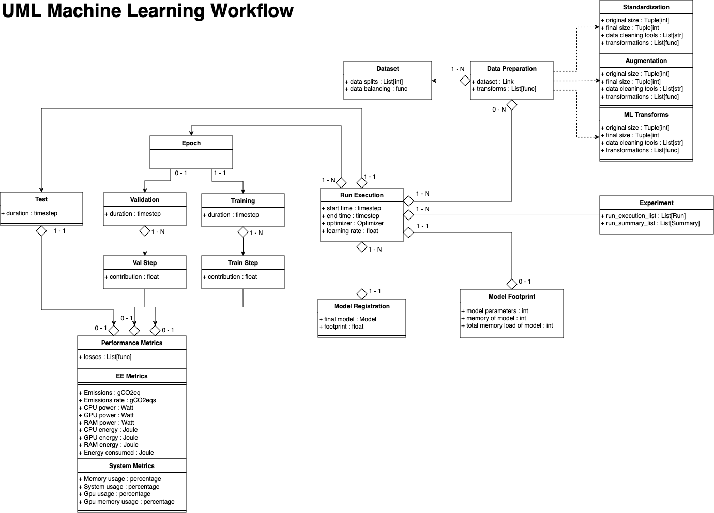
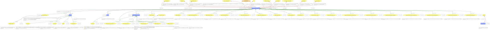
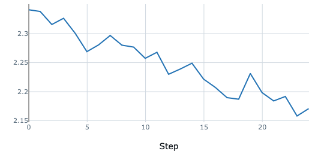
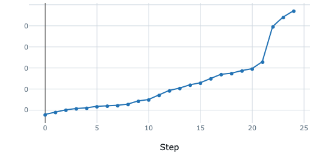
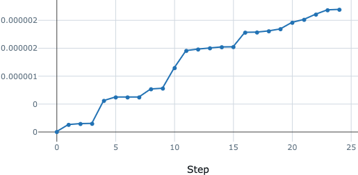

# Prov4ML

[](https://opensource.org/licenses/)

This library is a wrapper around MLFlow to provide a unified interface for logging and tracking provenance information in machine learning experiments. 

It allows users to create provenance graphs from the logged information.

## Data Model



## Example



The image shown above has been generated from the [example](./examples/mlflow_lightning.py) program provided in the ```example``` directory.

## Metrics Visualization

  |   
:-------------------------:|:-------------------------:
 |  
 | 

## Experiments and Runs

An experiment is a collection of runs. Each run is a single execution of a machine learning model. 
By changing the ```experiment_name``` parameter in the ```start_run``` function, the user can create a new experiment. 
All artifacts and metrics logged during the execution of the experiment will be saved in the directory specified by the experiment ID. 

Several runs can be executed in the same experiment. All runs will be saved in the same directory (according to the specific experiment name and ID).

# Documentation

For detailed information, please refer to the following documentation files:

- [Installation](./wiki/installation.md)
- [Setup](./wiki/setup.md)
- [Logging](./wiki/logging.md)
- [Carbon Metrics](./wiki/carbon.md)
- [System Metrics](./wiki/system.md)
- [Time Metrics](./wiki/time.md)
- [Usage with PyTorch](./wiki/usage_pytorch.md)
- [Usage with Lightning](./wiki/usage_lightning.md)
