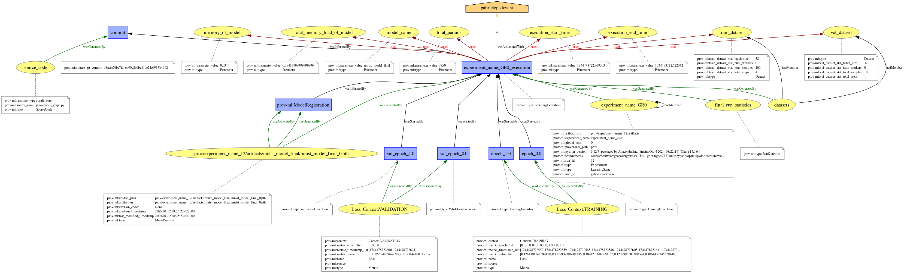
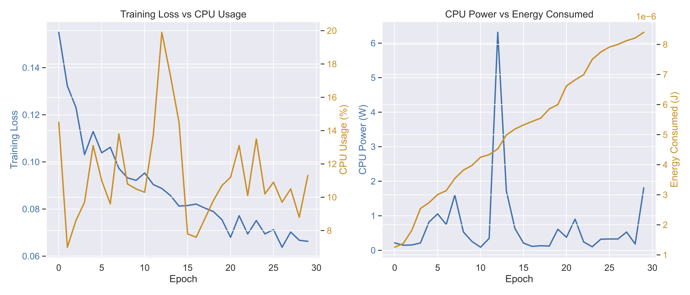
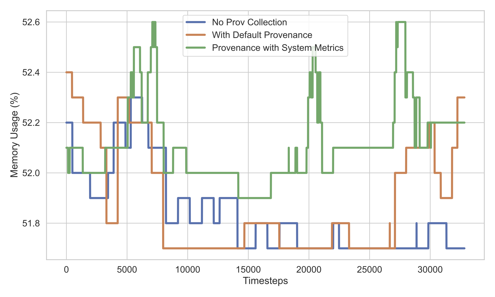

# SoftwareX Paper Supplementary Material

## Example of Provenance JSON

A full example of provenance graph is added in this subdirectory, it can be reproduced, by re-running the python script, or re-generated, by following the instruction in the documentation [here]() to create dot graphs and svg visualizations. 

- prov4ml_torch.py: a script using yProv4ML to collect provenance data. 
- provgraph_experiment_name_GR0.json: the final ProvJSON file, produced with the former script
- provgraph_experiment_name_GR0.dot: the provenance file converted to GraphViz graph
- provgraph_experiment_name_GR0.svg: the provenance graph visualization in svg format

## Charts in Paper Source Code and Data

We include the original data and script to produce Figure 2 in Section 3.  
- plot_data.json: a standard ProvJSON file produced with yProv4ML
- plot_charts.py: a script using yProv4ML to retrieve the data in the ProvJSON

## Full Working Example for yProv4ML Benchmark

For benchmarking the overhead caused by the use of yProv4ML, two scripts were produced. 
- prov4ml_torch.py: a pytorch script using yProv4ML to collect provenance data. 
- prov4mless_torch.py: a pytorch script without provenance collecttion, just saving the model weights incrementally. 

Since the former script, collecting all metrics caused large overhead, the same instance was tested with minimal metrics collection (just the loss function and no carbon or system metrics). 
This version of the python script is: `prov4ml_torch_metricless.py`. 

In addition, all results are already reported in the following files: 
- provwith.txt
- provwithoutmetric.txt
- provless.txt

And can be plotted using these final python script:
- plot_time.py: creates the time overhead chart;
- plot_mem.py: creates the memory overhead chart.

