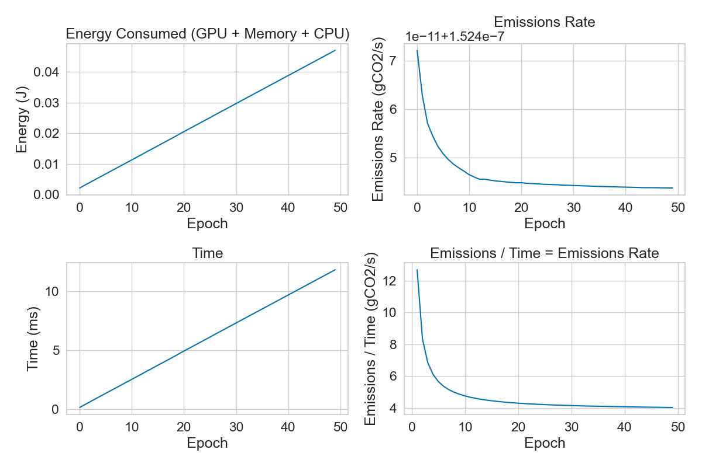

# Carbon Metrics

The prov4ml.log_carbon_metrics function logs carbon-related system metrics during machine learning experiments. 
The information logged is related to the time between the last call to the function and the current call.

```python
prov4ml.log_carbon_metrics(
    context: Context,
    step: Optional[int] = None,
)
```

| Parameter | Type     | Description                |
| :-------- | :------- | :------------------------- |
| `context` | `prov4ml.Context` | **Required**. Context of the metric |
| `step` | `int` | **Optional**. Step of the metric |

This function logs the following system metrics:

| Parameter | Description                | Unit |
| :-------- | :-------------------------: | :---: |
| `Emissions` | Emissions of the system | gCO2eq |
| `Emissions rate` | Emissions rate of the system | gCO2eq/s |
| `CPU power` | Power usage of the CPU | W |
| `GPU power` | Power usage of the GPU | W |
| `RAM power` | Power usage of the RAM | W |
| `CPU energy` | Energy usage of the CPU | J |
| `GPU energy` | Energy usage of the GPU | J |
| `RAM energy` | Energy usage of the RAM | J |
| `Energy consumed` | Energy consumed by the system | J |


### How is CO2Eq calculated? 

The CO2 equivalent (CO2eq) is a metric used to compare the emissions of CO2. 

- **CO2eq** is calculated by multiplying the energy consumed by the system by carbon intensity.
- **Energy** is calculated by multiplying the power usage by the time interval, this is done for each component (CPU, GPU, RAM).
- **Carbon intensity** is the amount of CO2 emitted per unit of energy consumed. It can be obtained in three ways:
    - Using cloud providers' carbon intensity data (Google). 
    - Using the carbon intensity of the grid where the system is running (per country).
    - Using the electricity mix of the grid where the system is running (renewables / gas / petroleum / coal).

### Why is it decreasing? 

The emissions rate can decrease due to the following reasons:
- **Idle time**: The system is not being used, so the power usage is low.
- **Energy efficiency**: The system is using less power to perform the same tasks.
- **Startup time**: The system is starting up, so the power usage is high at the beginning.

After plotting the metrics saved with codecarbon, we can see that the emissions rate decreases over time. 



This shows that energy is mostly constant over time, while the emissions rate decreases. This is due to the ratio between energy and time, which is decreasing over time.

[Home](README.md) | [Prev](carbon.md) | [Next](system.md)
